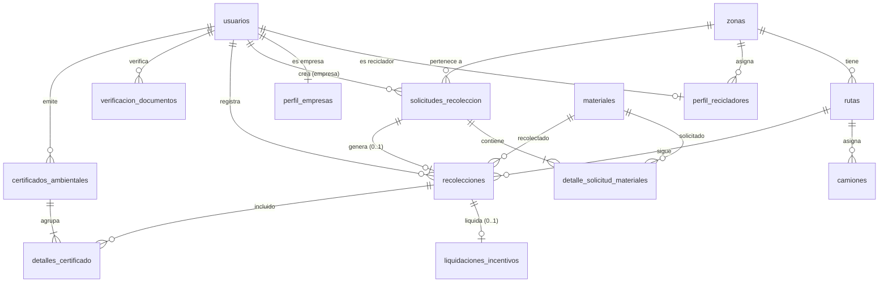

<p align="center">
  
  
  
</p>

# Green Loop — Recycling Platform Database

Database for a recycling platform that connects waste generators with authorized recyclers in the Atlántico region, Colombia.

## Tech Stack

| | |
| :-- | :-- |
| **Database** | PostgreSQL 18+ |
| **Container** | `greenloop` (Docker) |

## Prerequisites

- [Docker](https://docs.docker.com/get-docker/) installed and running
- PostgreSQL client (`psql`) or any SQL IDE (DBeaver, pgAdmin, etc.)

## Getting Started

### Start the database container

```bash
docker run -d ^
  --name greenloop ^
  -e POSTGRES_PASSWORD=postgres ^
  -p 5432:5432 ^
  postgres:18-alpine
```

### Connection details

| Property   | Value        |
| :--------- | :----------- |
| Host       | `127.0.0.1`  |
| Port       | `5432`       |
| User       | `postgres`   |
| Password   | `postgres`   |
| Database   | `postgres`   |

> ⚠️ Change the password in production via `POSTGRES_PASSWORD`.

### Run the SQL scripts

Follow the [Execution Order](#execution-order) below to initialize all database objects.

## Database Schema

```
greenloop/
├── 📁 Catalogs
│   ├── zonas                   Collection zones with rate multiplier
│   ├── usuarios                System users (admin, recycler, company)
│   ├── empresas                Legal entity registry
│   ├── materiales              Recyclable materials with code, price, CO₂ factor
│   ├── rutas                   Collection routes per zone
│   └── camiones                Trucks with QR code and capacity
├── 📁 Profiles
│   ├── perfil_recicladores     Recycler-specific data
│   └── perfil_empresas         Company platform profiles
└── 📁 Operations
    ├── verificacion_documentos  Document review audit trail
    ├── solicitudes_recoleccion  Collection requests
    │   └── detalle_solicitud_materiales
    ├── recolecciones            Field collection records (weight, GPS, quality)
    ├── liquidaciones_incentivos Recycler payment calculations
    └── certificados_ambientales Environmental certificates with SHA-256 hash
        └── detalles_certificado
```

### Entity-Relationship Diagram



## Constraints & Business Rules

| Rule | Description |
| :--- | :---------- |
| **Unique users** | `email` and `documento` must be unique across all users |
| **Unique materials** | `codigo` and `nombre` are unique |
| **Unique routes** | `codigo` is unique per route |
| **Unique vehicles** | `placa` and `qr_code` are unique per truck |
| **One material per request** | A material can appear only once per collection request |
| **One-to-one payment** | Each collection has at most one payment record |
| **Valid date range** | Certificate end date must be >= start date |
| **Positive weights** | All weight fields must be > 0 |
| **Valid quality** | Must be `Excelente`, `Aceptable`, or `Contaminado` |
| **Valid states** | `estado_solicitud`: pendiente, asignada, en_proceso, completada, cancelada |
| **Cascade deletes** | Deleting a user cascades to profile, requests, and verifications |

## Project Files

| File | Purpose |
| :--- | :------ |
| `Database/enums.sql` | ENUM types |
| `Database/tablas.sql` | Tables, constraints, and indexes |
| `Database/seed_data.sql` | Initial seed data |
| `Database/funciones.sql` | Business logic functions |
| `Database/vistas.sql` | Views |
| `Database/consultas.sql` | Report queries |
| `MER-green-loop.pgerd` | Entity-relationship diagram (pgModeler) |

## Execution Order

Run each script against the running `greenloop` container in this order:

```bash
docker exec -i greenloop psql -U postgres -d postgres -f Database/enums.sql
docker exec -i greenloop psql -U postgres -d postgres -f Database/tablas.sql
docker exec -i greenloop psql -U postgres -d postgres -f Database/seed_data.sql
docker exec -i greenloop psql -U postgres -d postgres -f Database/funciones.sql
docker exec -i greenloop psql -U postgres -d postgres -f Database/vistas.sql
```

`consultas.sql` is optional (SELECT-only report queries).

## Conventions

- Explicit `public` schema on all objects
- Idempotent scripts: `CREATE TABLE IF NOT EXISTS`, `CREATE INDEX IF NOT EXISTS`
- `TIMESTAMP` without time zone
- ENUMs created via `CREATE TYPE`
- Seed data guarded with `WHERE NOT EXISTS`

## Main Functions

| Function | Description |
| :------- | :---------- |
| `registrar_reciclador` / `registrar_empresa` | Create user with profile |
| `actualizar_reciclador` / `actualizar_empresa` | Update user profile data |
| `eliminar_usuario` | Delete user with cascade |
| `crear_solicitud` | Company requests material collection |
| `cambiar_estado_solicitud` | Change request status with validation |
| `eliminar_solicitud` | Delete pending or cancelled requests |
| `revisar_documentos_usuario` | Admin approves or rejects user documents |
| `asignar_reciclador_por_zona` | Assign least loaded recycler in zone |
| `registrar_recoleccion` | Record collection and auto-calculate payment |
| `liquidar_recoleccion` | Calculate rate + quality bonus |
| `generar_certificado` | Generate environmental certificate with SHA-256 hash |

## Contributing

Internal project. Create a feature branch from `database` and open a pull request with your changes.

## License

All rights reserved — Green Loop project.
